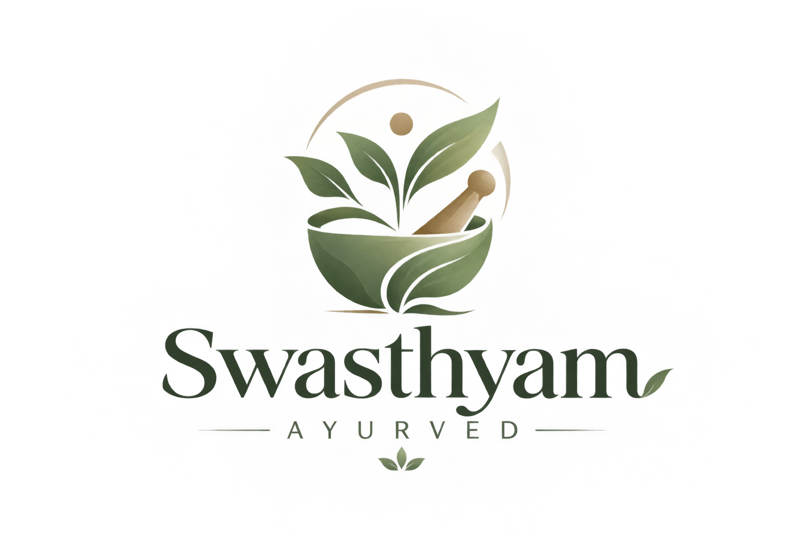

<div align="center">
  

  # 🌿 Swasthyam Ayurved

  **An immersive, cinematic web experience for an authentic Ayurvedic wellness clinic.**

  [](https://reactjs.org/)
  [](https://vitejs.dev/)
  [](https://tailwindcss.com/)
  [](https://greensock.com/)
  [](https://docs.pmnd.rs/react-three-fiber/)

</div>

---

## 📖 Overview

**Swasthyam Ayurved** is more than just a clinic website—it's a digital sanctuary. Designed to reflect the deep, healing roots of ancient wisdom, the platform combines modern, high-performance web technologies with an organic, nature-inspired aesthetic. 

From parallax tree canopies that sway as you scroll, to 3D falling petals and glassmorphic UI elements, the site offers a serene and engaging user journey through Ayurvedic treatments, Panchakarma therapies, and lifestyle wellness.

---

## ✨ Key Features

- 🍃 **Living Background:** A multi-layered, interactive parallax tree canopy built with GSAP. The branches subtly tilt and sway based on your scroll velocity (wind effect).
- 🌸 **3D Environment:** High-performance React Three Fiber (R3F) canvas rendering soft, falling petals across the screen.
- 🎬 **Cinematic Scroll Sequences:** Canvas-based image sequence rendering powered by GSAP ScrollTrigger for Apple-style scroll animations.
- 🪟 **Frosted Glass UI:** Lightweight, frosted glass cards (Glassmorphism) tailored for readability, depth, and seamless blending with the living background.
- 🧘 **Interactive Dosha Quiz:** A dynamic assessment tool helping users identify their Prakriti (Vata, Pitta, Kapha).
- 🌊 **Liquid Smooth Scrolling:** Integrated Lenis scroll for a buttery-smooth navigation experience across all devices.

---

## 🛠️ Tech Stack

| Category | Technology | Purpose |
|----------|------------|---------|
| **Core** | React + Vite | Fast compilation, modern component architecture |
| **Styling** | Tailwind CSS v4 | Utility-first styling, CSS variables, native nesting |
| **Animation**| GSAP | ScrollTrigger, Staggers, Parallax depth, velocity tracking |
| **3D** | React Three Fiber | WebGL petal particle systems |
| **Motion** | Framer Motion | Page transitions, mobile menu orchestration |
| **Scroll** | Lenis | Custom smooth scroll interpolation |
| **Routing** | React Router DOM | Multi-page routing (Treatments, Wellness, About, etc.) |

---

## 🚀 Getting Started

### Prerequisites
Make sure you have [Node.js](https://nodejs.org/) (v18+) installed.

### Installation

1. **Clone the repository:**
   ```bash
   git clone https://github.com/SOHAM0007-CODER/Ayurveda.git
   cd Ayurveda
   ```

2. **Install dependencies:**
   ```bash
   npm install
   ```

3. **Start the development server:**
   ```bash
   npm run dev
   ```

4. **Build for production:**
   ```bash
   npm run build
   ```

---

## 📂 Project Structure

```text
src/
├── components/       # Reusable UI elements (Header, Footer, Buttons)
├── motion/           # Animation wrappers (SmoothScroll, MotionKit)
├── pages/            # Route components (Home, Panchakarma, Wellness)
├── scene/            # 3D and Parallax background components
├── App.jsx           # Main router & layout shell
└── index.css         # Tailwind directives & global styling
public/
├── brand/            # Logos and SVG native cursors
├── tree/             # Parallax tree canopy layers
├── textures/         # Petal textures and noise maps
└── hero-seq/         # Cinematic scroll image frames
```

---

## 🎨 Color Palette & Design System

The site utilizes a strict, nature-inspired palette built directly into Tailwind via CSS variables:
- `forest`: Deep, grounding green.
- `botanical`: Vibrant leaf green.
- `sage`: Soft, muted herbal green.
- `terracotta`: Earthy, warm clay red.
- `saffron`: Golden-orange accent for active states.
- `sand` & `dawn`: Soft, warm off-whites for readable backgrounds and text.

---

<div align="center">
  <p>Built with ❤️ for Ayurveda and Holistic Healing.</p>
</div>
